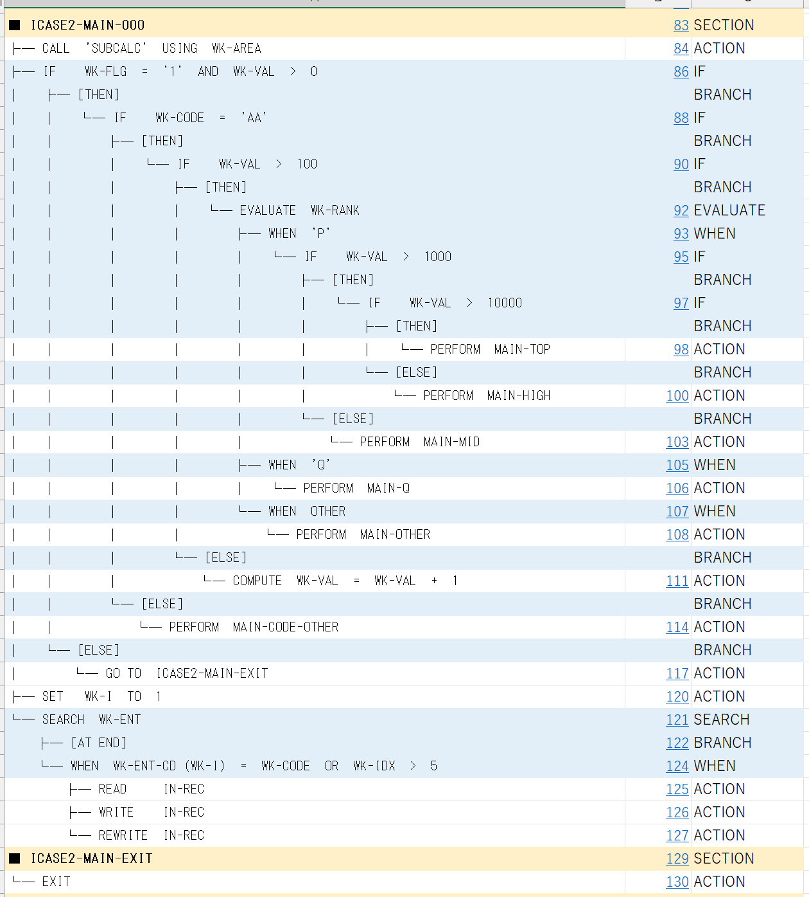

# cobol-logic-hierarchy

COBOL ソースを **PERFORM の呼出順（実行順）に沿って** 1 本のツリーへ展開し、Excel 上で可視化する単機能・軽量な VBA ツールです。
エントリのセクションから `PERFORM` を辿り、呼び出された段落／セクションをその場でインライン展開して右へ伸ばすので、
**「このプログラムが実際にどの順序で何を実行するか」を 1 画面で追える**のが特徴です。
**外部依存ゼロ**（Excel + VBA のみ、PowerShell / .NET 不要）。

## 何ができる

| シート | 内容 |
|---|---|
| **コントロール** | 解析開始ボタン |
| **COBOLソース** | 全行 + 物理行番号、実行順ツリーからのハイパーリンク先 |
| **ロジック階層** | `├── / └── / │` の罫線ツリー（**実行順**）。`PERFORM XXX` の下に呼出先のロジックをインライン展開。`IF` 下に `[THEN]` / `[ELSE]`、`EVALUATE` / `SEARCH` 下に `WHEN` / `[AT END]` を分岐ノード化。`END-xx` / `ELSE` / `WHEN` の対応ミスを `★ERROR` で赤表示 |

### 実行順ツリーの挙動

- **インライン展開**: out-of-line の `PERFORM 段落/セクション名` を検出すると、その呼出先の本体（配下の段落・文）を `PERFORM` 行の下にネストして展開し、呼出階層がそのまま右方向に伸びる
- **重複展開**: 同じセクションが複数箇所から `PERFORM` されている場合、各呼出箇所でそれぞれ展開する（実行の流れを忠実に再現）
- **再帰／循環の停止**: 展開中のパス上に再登場したセクションは `(再帰: XXX 展開済)` と表示して停止（無限ループを防止）
- **未到達セクションの追記**: エントリから `PERFORM` で辿り着けないセクションは、末尾に「(entry から未到達のセクション)」としてまとめて表示（取りこぼし無し）

その他の特徴:

- 行末ピリオドの有無を吸収（`END-IF.` も `END-IF` も統一処理）
- 多行 `IF` 条件は IF ノードのテキストに自動連結
- `SECTION` ヘッダは桁位置に依存せず内容（末尾 ` SECTION`）で判定。段落は所属セクション配下にネスト
- 文字コード自動判定（UTF-8 / UTF-16 BOM + UTF-8 妥当性検証 + Shift_JIS フォールバック）
- COBOL 固定形式（1〜6 桁=行番号、7 桁=標識、8〜72 桁=コード）前提
- `PROCEDURE DIVISION` 以降だけ解析、`DATA DIVISION` 等は除外

## インストール

### 方法 A: インポート（おすすめ）

1. 任意の `.xlsm`（マクロ有効ブック）を新規作成
2. `Alt + F11` で VBE を開く
3. メニュー `ファイル → ファイルのインポート` で `vba/LogicHierarchy.bas` を選択
4. `デバッグ → VBAProject のコンパイル` でエラーが無いことを確認
5. `SetupControlSheet` にカーソルを置き `F5` を一度実行 → 「コントロール」シートとボタンが生成される

### 方法 B: 手書きコピー（環境が物理隔離されている場合）

`vba/LogicHierarchy.bas` の中身を VBE の標準モジュールに手で入力してください。
1 行目の `Attribute VB_Name = "LogicHierarchy"` は VBE が自動管理するので入力不要、`Option Explicit` から書き始めます。

## 使い方

1. 「コントロール」シートのボタン **「COBOL ソースを選択して解析」** をクリック
2. ファイル選択ダイアログで `.cbl` / `.cob` / `.txt` / `.src` / `.cpy` を選択
3. **COBOLソース** と **ロジック階層** シートが自動生成
4. **ロジック階層** の「開始行」列の数字をクリック → **COBOLソース** の該当行へジャンプ

サンプルは `samples/input/ICASE2.cbl`。

## 制限事項

- COBOL 固定形式が前提。最左 1〜7 桁がコードではなく行番号/標識である想定です。コードが 1 桁目から始まる自由形式は未対応。
- 動詞ホワイトリストに無い文（特殊な拡張文）は `ロジック階層` には表示されません（`COBOLソース` には全行表示）。
- 重複展開のため、多くの箇所から `PERFORM` されるセクションを持つプログラムでは出力が大きくなります（暴走防止のため 20,000 行で打ち切り）。
- フォールスルー実行（セクション終端から次セクションへ落ちる流れ）は追跡しません。展開は `PERFORM` 呼出に基づきます。
- `PERFORM X THRU Y` は X の展開で近似します（THRU 範囲は厳密には追いません）。
- `GO TO` の制御フロー追跡、`COPY` 句展開、テストケース生成、分岐カバレッジは対象外。

## ライセンス

MIT License. 詳細は `LICENSE` を参照。

## 動作確認

- Windows 11 + Excel 2021 (Microsoft 365) で動作確認
- 必要な参照: Office Object Library（既定で有効）、Microsoft ActiveX Data Objects（COM 経由で `ADODB.Stream` を使用、参照設定追加不要）
